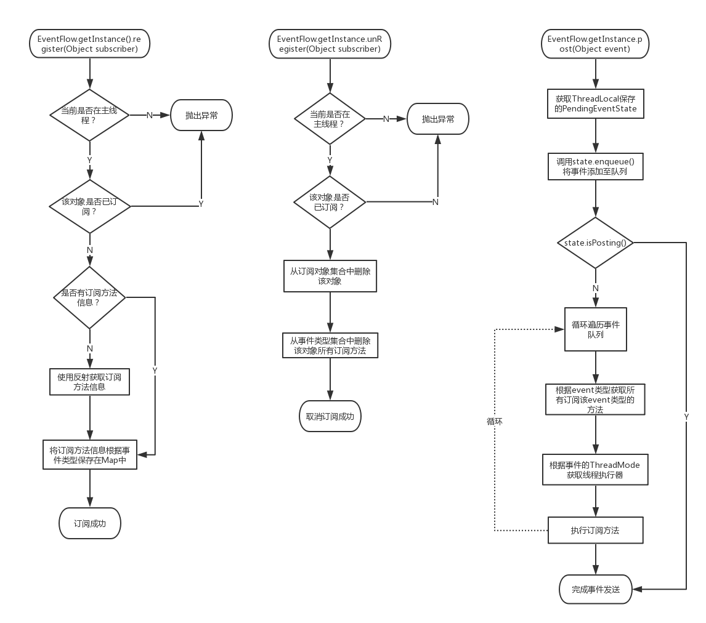

# EventFlow
基于反射的事件流传递简单版本，类似EventBus。

源码中有非常详细的注释，如果你还不了解EventBus的原理，可以看看这个简单一点的版本，一定会有收获的。也可以基于源码自行扩展。

以下是一致可扩展的方向：

 1. 根据事件优先级进行传递
 2. 可以先发送后订阅，例如EventBus的postSticky方法
 3. 使用APT方式来处理注解
 4. 处理事件类的继承关系
 
如果之后有时间，我会完善一下这个库。

## 核心流程

